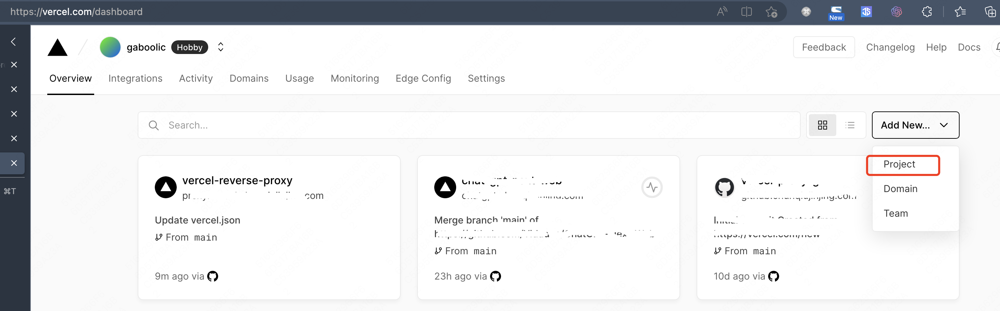
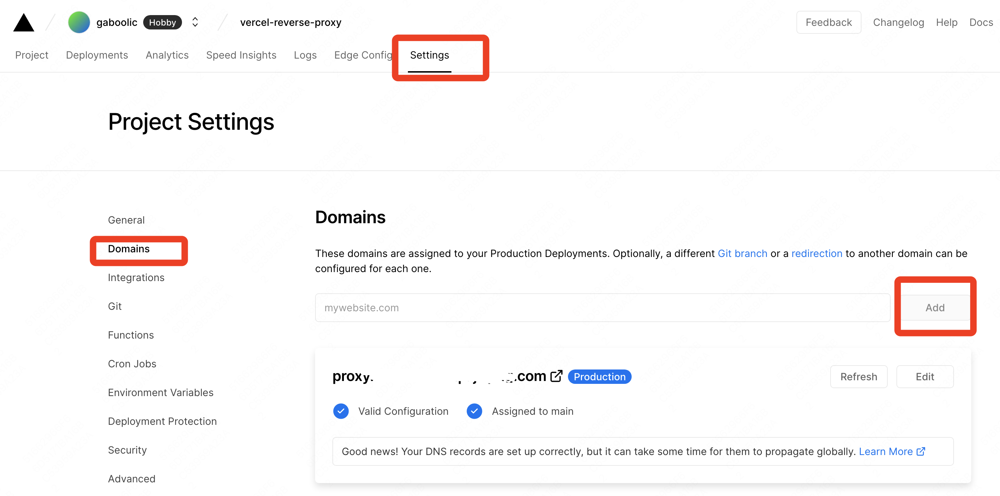
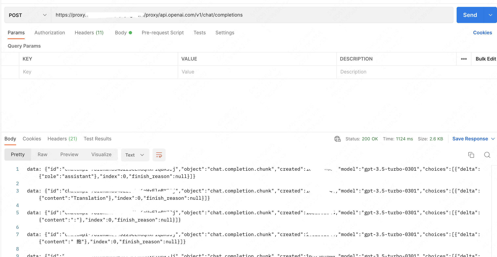
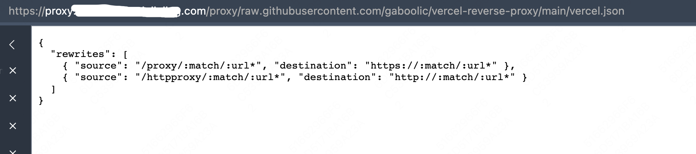
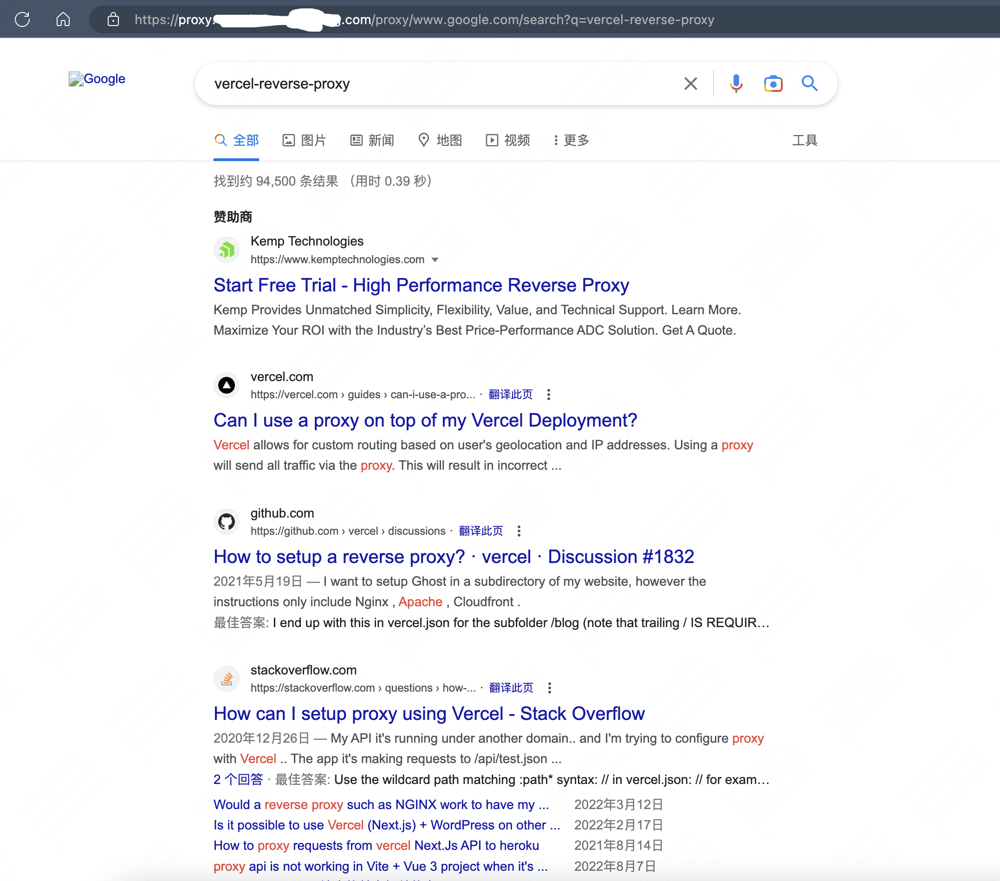

# vercel-reverse-proxy
[简体中文](./README.md)

This project is a Vercel reverse proxy. It's completely free and an all-purpose proxy that can handle all interfaces on the internet, including OpenAI, GitHub, Google, and more. Both HTTP and HTTPS interfaces as well as single pages can be proxied and used in poor network environments. (When accessing the proxy page directly from a browser, some JS and CSS paths may not work correctly causing access issues and minor styling problems.)
## Deploy

## How to Use
1 Deployment. There are two methods for deployment: one is to directly click the button above for one-click deployment, and the other is to first fork this project and then log in [vercel](https://vercel.com/) to create new one.

2 Bind your own domain name (not mandatory, you can also use Vercel's built-in subdomain, but the built-in domain vercel.app may not be accessible in poor network conditions in China).

When binding a domain, simply follow the instructions on Vercel to configure it. Essentially, you are setting up a subdomain on your domain and pointing its CNAME record to the Vercel server.
3 To visit the https://yourdomain.com/proxy/url, or https://yourdomain.com/httpproxy/url.
The mapping rule is to map /proxy/url to the https interface, and /httpproxy/url to the http interface.

demo1: visit https://yourdomain.com/proxy/api.openai.com/v1/chat/completions
Actually will be replaced with https://api.openai.com/v1/chat/completions

demo2: visit https://yourdomain.com/proxy/raw.githubusercontent.com/gaboolic/vercel-reverse-proxy/main/vercel.json
Actually will be replaced with https://raw.githubusercontent.com/gaboolic/vercel-reverse-proxy/main/vercel.json

The mapping rule is to map /proxy/url to the https interface, and /httpproxy/url to the http interface.

demo3: visit https://yourdomain.com/proxy/www.google.com/search?q=vercel-reverse-proxy
Actually will be replaced with https://www.google.com/search?q=vercel-reverse-proxy

Reverse proxy Google search results page.

